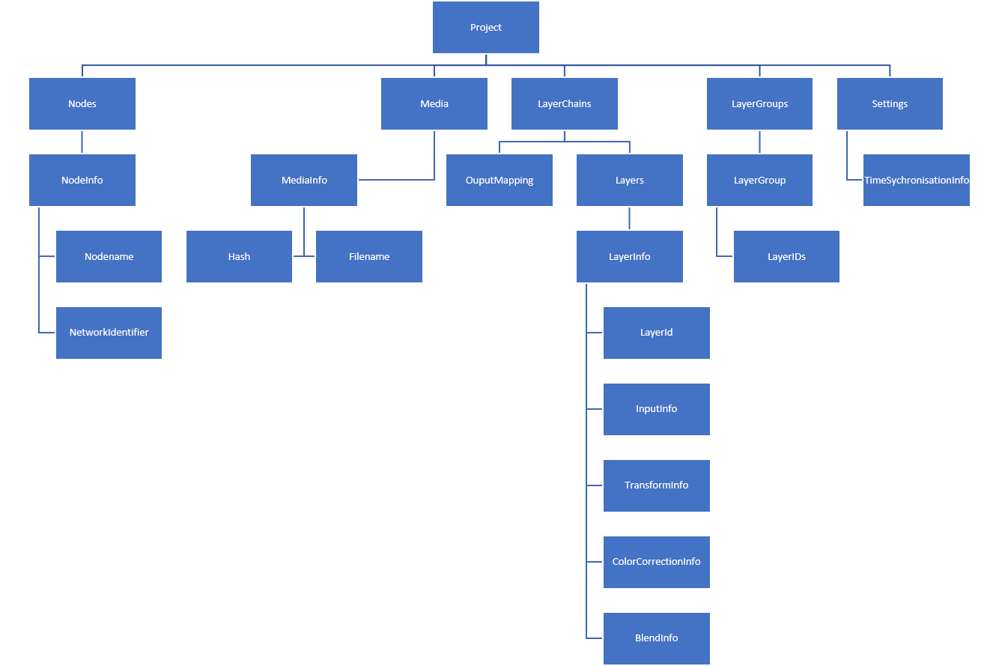

# Konfiguration

Es gibt 3 Unterschiedliche Konfiugrationen

- Controller: Enthält Konfiurationen die nach dem Startup nicht mehr Aktualisiert werden.
  Z.B. Ports, Logging, Media Pfade, etc...
  Die Datei wird auf dem Controller gespeichert.
- Projekt: Enthält alle Porjektspeztifischen Konfigurationen die zur Laufzeit geändert werden können.
- Node: Enthält Konfiurationen die nach dem Startup nicht mehr Aktualisiert werden.
  Z.B. Adresse des Controllers, Media Pfad etc...
  Die Datei wird auf der Node gespeichert. 

## Controller Konfiguration
Aktuelle Parameter sind:
- Logging Level
- Grpc/Node Verbindungsport
- Angular Webapp Port
- Media Pfad
- Konfiguration für Projektdateien Backups

## Projekt Konfiguration

Ein erster Entwurf für die Projektstruktur:

Die Projektkonfiguration wird in Memory gehalten und __nicht__ mit einer Datei sychronisiert. Es ist jedoch möglich Projektdateien zu Import- und Exportieren um so einen Projektstand zu sichern. 

## Node Konfiguration
Aktuelle Parameter sind:
- Logging Level
- Controller Adresse (Umsetztung noch nicht klar)
- Media Pfad

// Evtl. in die Projektkonfiguration verschieben
- FPS
- Display Resolution

