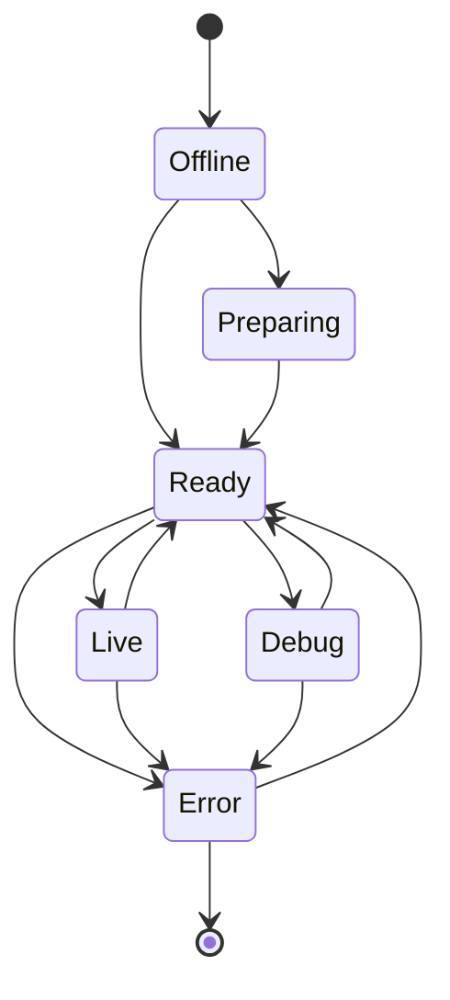

# Node

## States
Eine Node befindet sich immer in einem der folgenden Zustände:

```mermaid
stateDiagram
    Offline
    Preparing
    Ready
    Live
    Debug
    Error

    [*] --> Offline
    Offline --> Preparing
    Offline --> Ready
    Preparing --> Ready
    Ready --> Debug
    Ready --> Live
    Ready --> Error
    Live --> Ready
    Live --> Error
    Error --> Ready
    Debug --> Ready
    Debug --> Error
    Error --> [*]
```