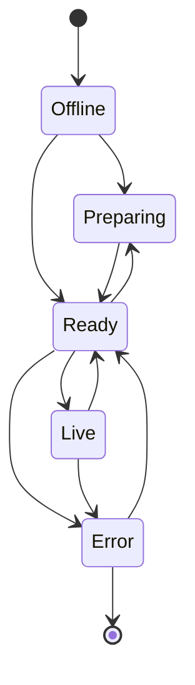

# Node

## States
Eine Node befindet sich immer in einem der folgenden Zustände:

Ein Zustandwechsel (bspw. von Ready nach Live oder von Live nach Ready) wird vom Controller über Commands gefordert. Diese Commands bestehen aus einem Enum der verschiedenen Befehle, welche von der Node interpretiert werden:
- GoLive
- GoReady
- ShowInfo
- HideInfo
- _(RebootNode)_
