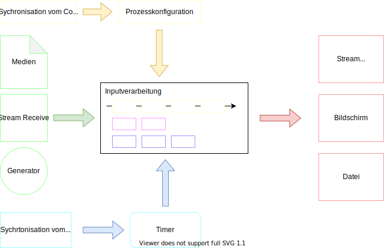

# Renderengine

Die Renderengine ist der Prozess der die Gesamte Grafikmanipualtion vornimmt und für das darstellen der Medien verantwortlich ist.

## Übersicht

## Funktionsweise von Layern

Das Verarbeiten und Kombinieren von verschiedenen Inputs wird über Layer gelöst.
Die Layer werden übereinander gelegt und auf unterschiedliche Art und Weise überlagert.
Denkbar wäre dabei ein Maskieren, Keying, usw..

### Prozesskonfiguration
Die Prozesskonfiguration kümmert sich um die Verarbeitung der verschiedenen Layer.
Sie beinhaltet die Konfigurationen der Layers und gibt der Inputverarbeitung die "Pläne" wie sie die Inputs verarbeiten soll.

Evtl. kann die Kompnente später in "Live" und "Edit" aufgeteilt werden.
- Live kümmert sich um die aktiven Layer und das __Verändern der Prozesskette__.
- Edit kümmert sich um die einzelnen Layer und deren Parameteranpassung.
"Live" und "Edit" __müssen nicht beide parallel ansprechbar__ sein.
Bedeutet es gibt den Zustand Live und der Zustand Edit die sich gegenseitg ausschließen.

### Inputverarbeitung

Die Inputverarbeitung koordiniert die einzelnen Layer und deren Verarbeitung, die Layer kümmern sich selbst um die Bearbeitungen und geben den einzelnen Frame dann wieder zurück.

### Inputs
Unterstützt werden sollen verschiedene Inputtypen: Medien/Dateien, Videostreams und Bildgeneratoren.

### Timer

Der Timer kümmert sich um die Sychronisation der Controller Uhr und der einzelnen Nodes.
Der Timer ist hierbei Taktgeber und gibt die aktuelle Framenummer an, die einzelnen Layer berechnen sich anhand dieses Mastertaktes den eigenen Takt.
So kann es z.B. sein das ein Video erst ab Takt 2000 zu sehen ist, der Layer muss den dazu passenden Frame für sich berechnen und erzeugt so seinen eigenen "Takt".

Mögliche maßnahmen beim auseinander driften von dem Controller Takt und Node Takt:

- __Harte Sychronisation__: der Takt von der Node gleicht sich sofort mit der des Controllers an, egal wie groß der Framedrop ist.
  Nachteil ist, es kann zu vielen Rucklern kommen die das schauen unangenehm machen können.
- __Toleranz Sychronsiation__: Um diesen Rucklern vor zu beugen wird bei einer Minalabweichung nichts unternommen. Erst wenn die beiden Zeiten stark auseinander driften wird eine harte Sychronisation vorgenommen:
- __Weiche Sychronisation__: Dabei wird nicht Hart sychronsiert sollten die beiden Zeiten auseinander Driften, wird durch ein schnelleres/langsameres Abspielen versucht die Zeit anzupassen.
  Dabei werden einzelnen Frames dann übersprungen oder länger dagestellt.

### Output
Unterstützt werden sollen hierbei auch verschiedene Outputs Streaming als Sender, eine Displayausgabe und speichern in eine Datei.